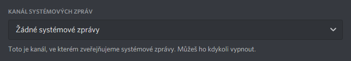
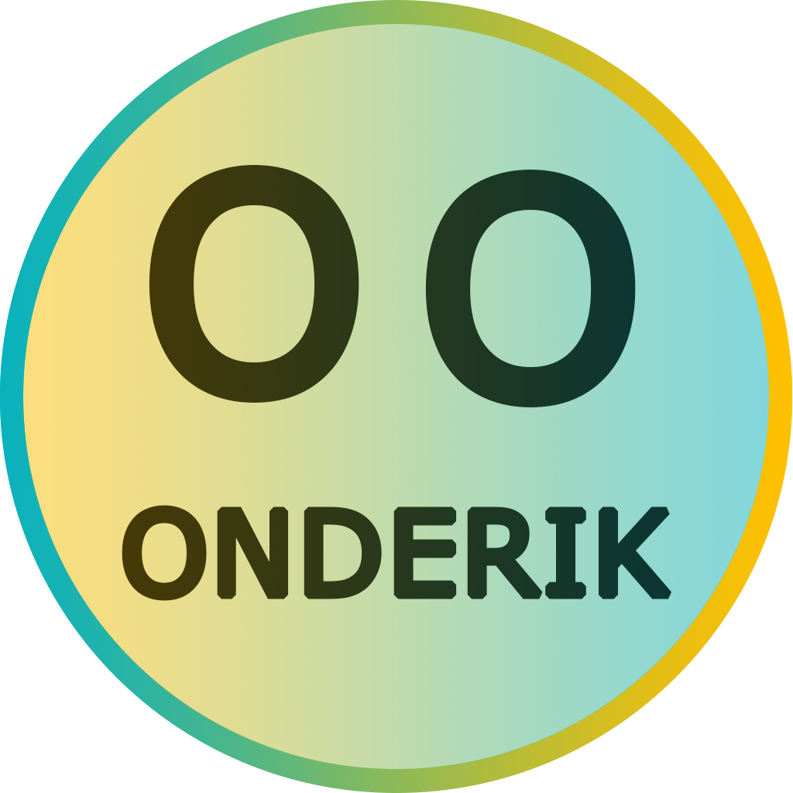
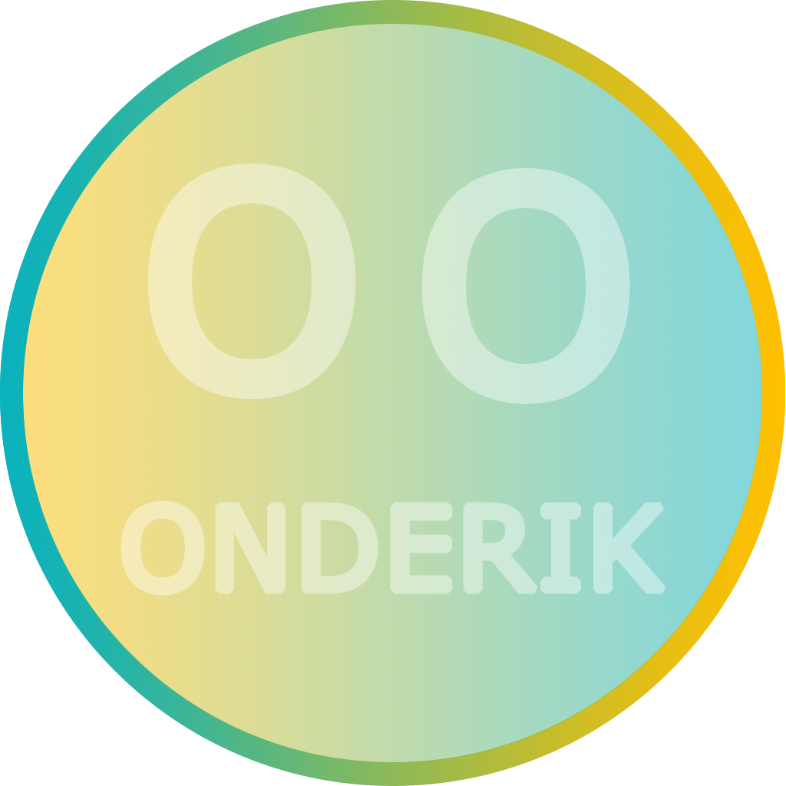

<p>
    
    
</p>

<p></p>

# ABOUT

[ADD TO YOUR SERVER](https://discord.com/api/oauth2/authorize?client_id=804733813976203284&permissions=8&scope=bot)

[Onderik WEBSITE](https://ondrasalek.github.io/onderik/)

[Discord Support Server -> Onderik-Support](https://ondrasalek.github.io/onderik/)

Bot can do:

- sending welcome and bye messages
- showing info about members, roles, server, channel and Bot self
- deleting messages
- play songs

## You need these packages (python 3.+)

```shell
pip install discord.py
pip install discord
pip install validators
pip install youtube_dl
pip install python-dotenv
```

## You can choose what you want to use

1. .ENV

```python
import os
from dotenv import load_dotenv
load_dotenv()
token = os.getenv("token")
prefix = os.getenv("prefix")
```

2. JSON

```python
import json
with open("configuration.json", "r") as config: 
 data = json.load(config)
 token = data["token"]
 prefix = data["prefix"]
```

# Commands `.help <command>`

## Admin

|COMMAND | ABOUT command | Arguments|
|:---  | :---  | :--- |
|`.set_autorole <role>` | Setting auto role | `<role name / id / @mention>` & `"now"`|
|`.set_botlog <channel>` | Setting channel BotLog | `<channel name / id / #mention>` & `"now"`|
|`.set_guild_url <url>` | Setting url link to server | `"<url>"` & `"now"`|
|`.set_msg_private <message>` | Setting Private welcome message (max 255 chars) | `"<message>"` & `"now"`|
|`.set_msg_welcome <message>` | Setting Channel Welcome message (max 255 chars) | `"<message>"` & `"now"`|
|`.set_msg_bye <message>` | Setting Channel Bye message (max 255 chars) | `"<message>"` & `"now"`|
|. | . | .|
|`.clear <number>` | Delete number of messages (max 333) | `<number>` (1-333)|

## Everyone

### - INFO

|COMMANDS | ABOUT command | Arguments|
:---  | :---  | :--- |
|`.info_bot` | Info about BOT | .|
|`.info_channel` | Info about Channel | .|
|`.info_server` | Info about Server | .|
|`.info_role` | Info about Role | .|
|`.info_role <role>` | List of members if Role | `<role name / id / @mention>`|
|`.info_user` | Info about You | .|
|`.info_user <user>` | Info about Member | `<user name / nick / id / @mention>`|

### - Music

|COMMANDS | ABOUT command | Arguments|
:---  | :---  | :--- |
|`.play` | Play song (YouTube) | `<URL / name / author...>`|
|`.pause` | Pause | .|
|`.resume` | Resume | .|
|`.stop` | Stop | .|

# Guild setting

|What to do | is here|
:---  | :--- |
|If you want welcome and bye messages you should turn on this ||

# IMAGES

|PICTURE | NAME|
:---:  | :--- |
|| Banner Black|
|| Banner White|
|| Logo|
